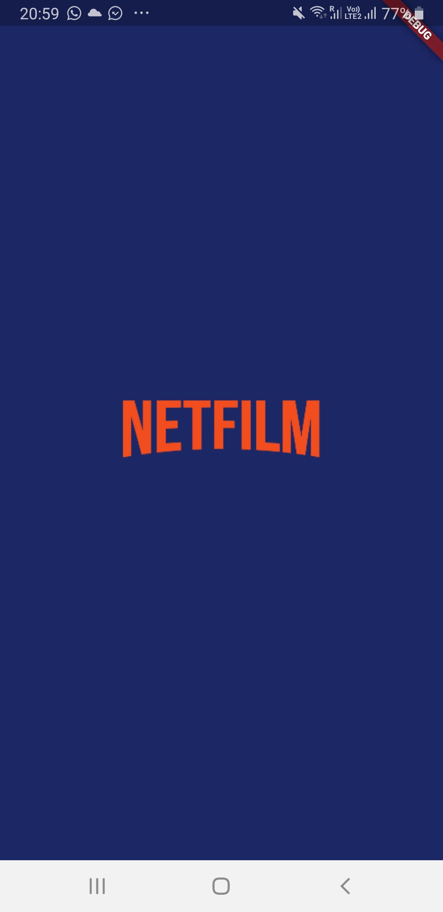
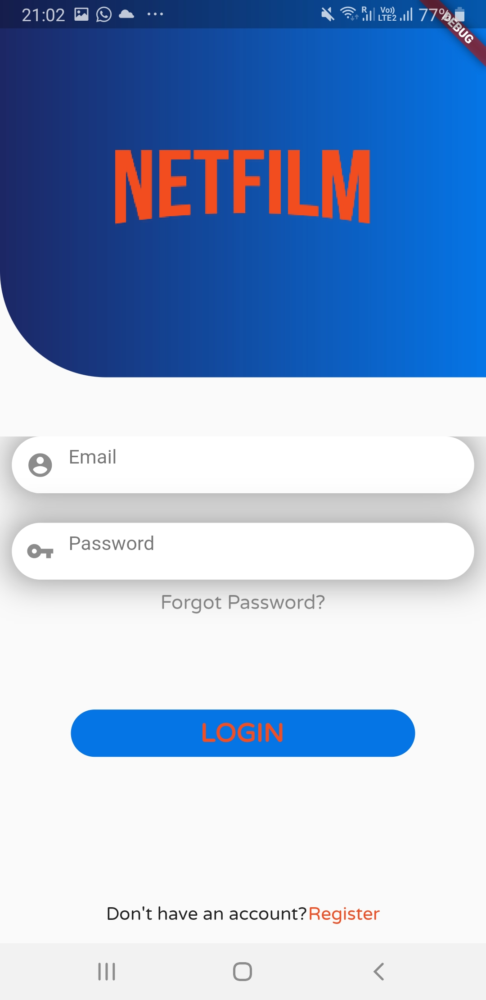
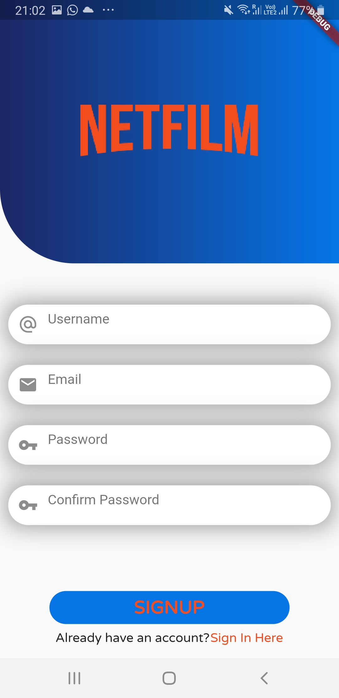
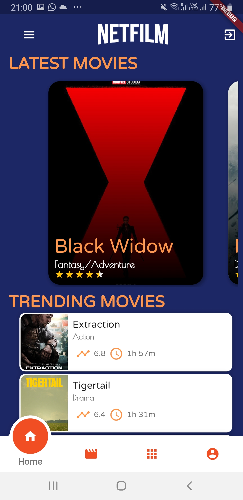
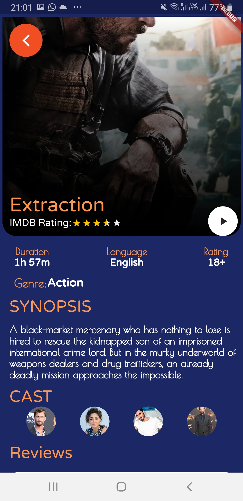
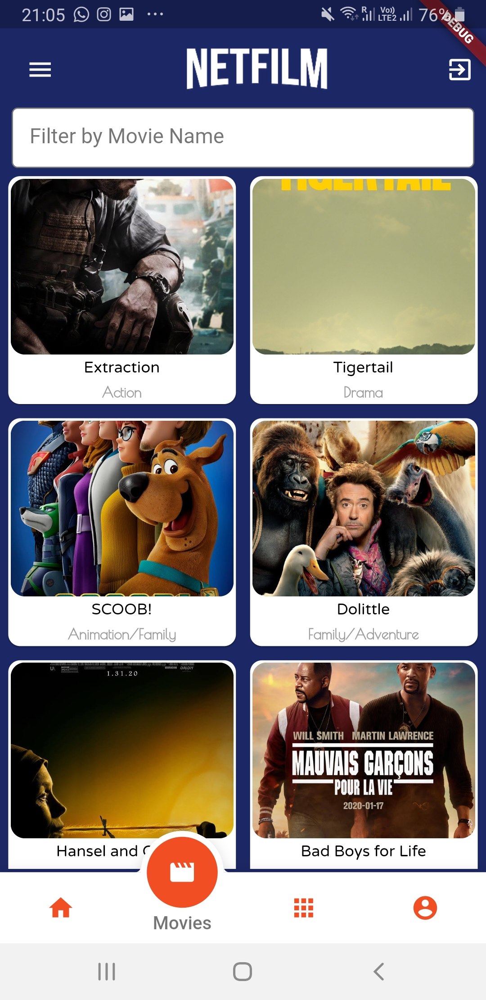
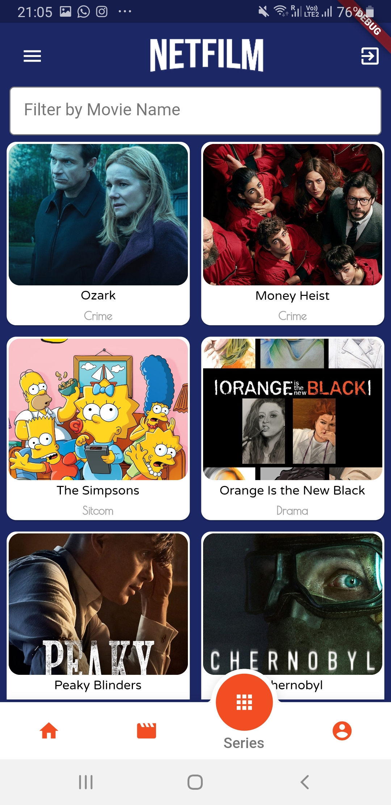
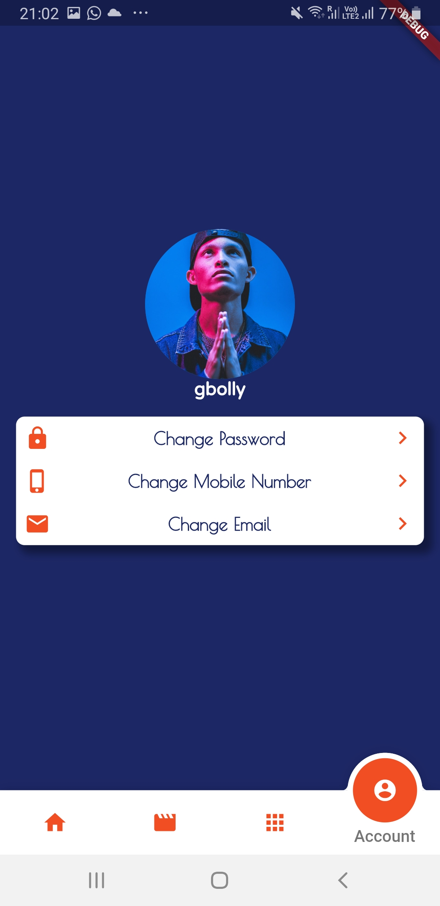

# movie_app

This is a prototype of a movie streaming application built with Flutter, that allows users stay upto date with movies and series. Users can also view trailers of new movies and view reviews of other users 

 \   

 \   

 \   

 \   

 
